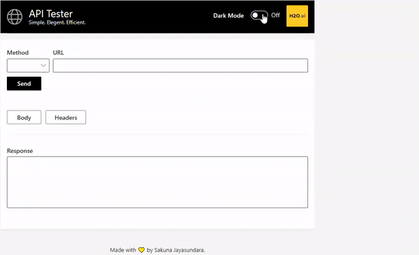
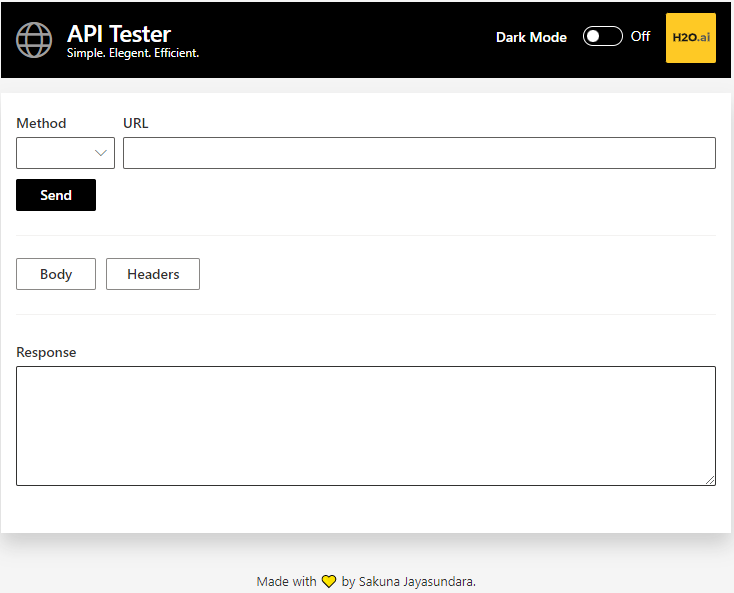

<div align="center">
  
  []()
  [](https://github.com/sakunaharinda/api-tester/issues)
  [](https://github.com/sakunaharinda/api-tester/pulls) 
  []()
  
</div>

<br />
<div align="center">
  <a href="https://github.com/sakunaharinda/api-tester">
    
  </a>
  <h2 align="center">API Tester</h2>
  <p align="center">
    <strong>Application for API Testing powered by H2O Wave</strong>
    <br/>
    <a href="https://github.com/sakunaharinda/api-tester/blob/main/README.md"><strong>Explore the docs »</strong></a>
    <br />
    <br />
    <a href="https://github.com/sakunaharinda/api-tester">View Demo</a>
    ·
    <a href="https://github.com/sakunaharinda/api-tester/issues">Report Bug</a>
    ·
    <a href="https://github.com/sakunaharinda/api-tester/issues">Request Feature</a>
  </p>
  <br/>
  <figure>
    
    <br/>
    <figcaption align = "center"><i><small>Demo</small></i></figcaption>
  </figure>
  
  
</div>
<br/>

## Table of Contents

- [Introduction](#intro)
- [System Requirements](#req)
- [Quick Start](#qstart)
  - [H2O Wave Installation](#qstart_waveinstall)
  - [Setting Up the project](#qstart_setup)
  - [Run the application](#qstart_run)
- [Features](#features)
- [List of used H2O Wave SDK Components](#comp)
- [Acknowledgements](#ack)

## Introduction <a name = "intro"></a>

H2O Wave is a software stack for building beautiful, low-latency, real-time, browser-based applications and dashboards entirely in Python without using HTML, Javascript, or CSS. Using the framework, we can develop any kind of a business application or any data science related application. In this project, an application to test your APIs has been developed using H2O Wave as a Business Application. Instructions for setting up the environment and running the application can be found in the following sections.

## System Requirements <a name = "req"></a>

- Python
- pip
- GIT

## Quick Start <a name = "qstart"></a>

### H2O Wave Installation <a name = "qstart_waveinstall"></a>

1. Download and extract the H2O Wave SDK for your platform using -
https://github.com/h2oai/wave/releases/tag/v0.19.0 
2. Move it to a location of interest. ($HOME/wave/)
3. Go to your Wave directory and open a new terminal. Start the wave server using,
  ```
./waved
```

Step-By-Step guide can also be found [here](https://wave.h2o.ai/docs/installation).

### Setting Up the project <a name = "qstart_setup"></a>

1. Clone the repository and go inside the folder.
  ```
  git clone https://github.com/sakunaharinda/api-tester.git
  cd api-tester
  ```
2. Set up the virtual environment
  ```
   python3 -m venv venv
   source venv/bin/activate
  ```
3. Install the dependancies
  ```
  pip install -r requirements.txt
  ```
  
### Run the application <a name = "qstart_run"></a>

1. Run the application using the following command
  ```
  wave run api_tester
  ```
2. Then visit [localhost:10101](http://localhost:10101/api)
3. Then you will see the following screen.

<div align="center">
  <figure>
    
    <br/>
    <figcaption align = "center"><i><small>Home page</small></i></figcaption>
  </figure>
</div>
<br/>

4. Sample test data to test the application
   - GET : https://run.mocky.io/v3/27c4d516-4d91-4414-91e9-7978e26e8d05

## Features <a name = "features"></a>

🔮 Ability to test any API with GET, POST, PUT and DELETE method
<br/>
📄 Ability to add a request body if needed
<br/>
📜 Ability to add and delete headers
<br/>
🌞 Ability to change the theme between light and dark
<br/>

## List of used H2O Wave SDK Components <a name = "comp"></a>

1. Text box
2. Dropdown
3. Message Box
4. Toggle
5. Header
6. Footer
7. Table
8. Dialog
9. Button
10. Form Card
11. Meta Card

## Acknowledgements <a name = "ack"></a>

- H2O wave SDK - https://github.com/h2oai/wave 
- H2O Wave Documentation and Examples - https://wave.h2o.ai/docs/examples 


